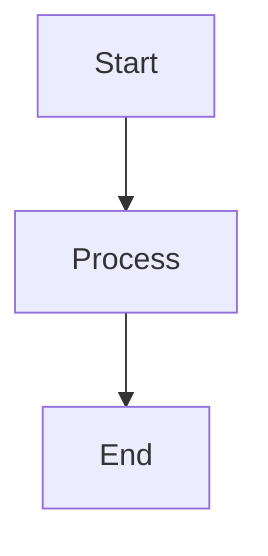

# Markdown Documentation Skill

## Description
Create well-structured technical documentation using Markdown with GitHub/GitLab flavor support.

## When to Use
- README files
- Wiki pages
- Technical blogs
- Documentation sites (MkDocs, Docusaurus)

## Markdown Syntax Reference

### Headings
```markdown
# H1 - Page Title
## H2 - Major Section
### H3 - Subsection
#### H4 - Minor Section
```

### Text Formatting
```markdown
**Bold text**
*Italic text*
***Bold and italic***
~~Strikethrough~~
`Inline code`
```

### Lists
```markdown
- Unordered item
- Another item
  - Nested item

1. Ordered item
2. Another item
   1. Nested item
```

### Links & Images
```markdown
[Link text](https://url.com)

[Relative link](./other-page.md)
```

### Code Blocks
````markdown
```python
def hello():
    print("Hello, World!")
```
````

### Tables
```markdown
| Header 1 | Header 2 |
|----------|----------|
| Cell 1   | Cell 2   |
| Cell 3   | Cell 4   |
```

### Task Lists (GitHub Flavor)
```markdown
- [x] Completed task
- [ ] Pending task
- [ ] Another task
```

### Admonitions/Alerts
```markdown
> **Note**: Important information
> **Warning**: Be careful here
> **Tip**: Helpful suggestion
```

## Advanced Features

### Table of Contents
```markdown
## Table of Contents
- [Introduction](#introduction)
- [Installation](#installation)
- [Usage](#usage)
```

### Collapsible Sections
```markdown
<details>
<summary>Click to expand</summary>

Hidden content here

</details>
```

### Mermaid Diagrams (GitHub)
````markdown

````

## Best Practices
- Use consistent heading levels
- Don't skip heading levels
- Add alt text to images
- Use relative links for internal docs
- Keep lines < 120 characters for readability
- Add blank lines between elements
- Use fenced code blocks (```) over indented
- Include language identifier for syntax highlighting

## Quality Checklist
- ✅ Proper heading hierarchy
- ✅ Links all work
- ✅ Images have alt text
- ✅ Code blocks have language specified
- ✅ Table of contents for long docs
- ✅ Consistent formatting
- ✅ Renders correctly on target platform
